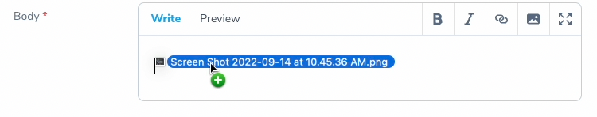

# Laravel Nova Enhanced Markdown Field

<p align="center">
    
</p>

> A custom Markdown Field for Nova with image upload support

[](https://packagist.org/packages/ardenthq/nova-enhanced-markdown) [](https://packagist.org/packages/ardenthq/nova-enhanced-markdown) [](https://packagist.org/packages/ardenthq/nova-enhanced-markdown)

## Features

- For Laravel Nova ^4.0
- Image upload
- Accepts Drag & Drop / Copy & Paste

<p align="center">
    
    
</p>

## Installation

```console
composer require ardenthq/nova-enhanced-markdown
```
## Use

1. Add the `EnhancedMarkdown` field to your Nova Resource.

```php
<?php
namespace App\Nova;

use Laravel\Nova\Http\Requests\NovaRequest;
use Laravel\Nova\Resource;
use Ardenthq\EnhancedMarkdown\EnhancedMarkdown;

final class ResourceName extends Resource
{
    // ....
    public function fields(NovaRequest $request)
    {
        return [
            // ....
            EnhancedMarkdown::make('body'),
            // ...
        ];
    }
    // ...
}
```

2. By default, this package only validates the attachment as an actual file. If you require more rules (let's say that you only want to accept images), define the rules with the `attachmentRules` method.

```php
EnhancedMarkdown::make('Content', 'content')
    ->attachmentRules('dimensions:min_width=20,min_height:20', 'image'),
```

3. In some cases, you may want to parse the file before storing it (for example, apply some optimizations). To do that, you can add a callback by using the `parseFile` method.

```php
EnhancedMarkdown::make('Content', 'content')
    ->parseFile(function (EnhancedMarkdown $field, UploadedFile $file) {
        $image = \Spatie\Image\Image::load($file->getPathname());
        $image->fit(\Spatie\Image\Manipulations::FIT_MAX, 100, 100);
        $image->save();
    });
```

If needed, you can also return a new instance of the file, that instance is the one that is going to be stored.

Important: You need to return an instance of `Illuminate\Http\UploadedFile`, `Illuminate\Http\File` or a `string`. 

```php
EnhancedMarkdown::make('Content', 'content')
    ->parseFile(function (EnhancedMarkdown $field, UploadedFile $file) {
        return new File('some/path');
    });
```

## Development

1. Run `yarn nova:install` and `yarn install` to install all the necessary dependencies for compiling the view components.
2. Run `yarn run dev` (or `yarn run watch`) while making changes to the components in your local environment.
3. If you change the vue components, ensure to compile for production before making a PR.

### Compile for production

1. Run `yarn nova:install` and `yarn install` to install all the necessary dependencies for compiling the view components.
2. Run `yarn run production`.

### Analyze the code with `phpstan`

```bash
composer analyse
```

### Refactor the code with php `rector`

```bash
composer refactor
```

### Format the code with `php-cs-fixer`

```bash
composer format
```

### Run tests

```bash
composer test
```

## Security

If you discover a security vulnerability within this package, please send an e-mail to security@ardenthq.com. All security vulnerabilities will be promptly addressed.

## Credits

This project exists thanks to all the people who [contribute](../../contributors).

## License

[MIT](LICENSE) © [Ardent](https://ardenthq.com)
